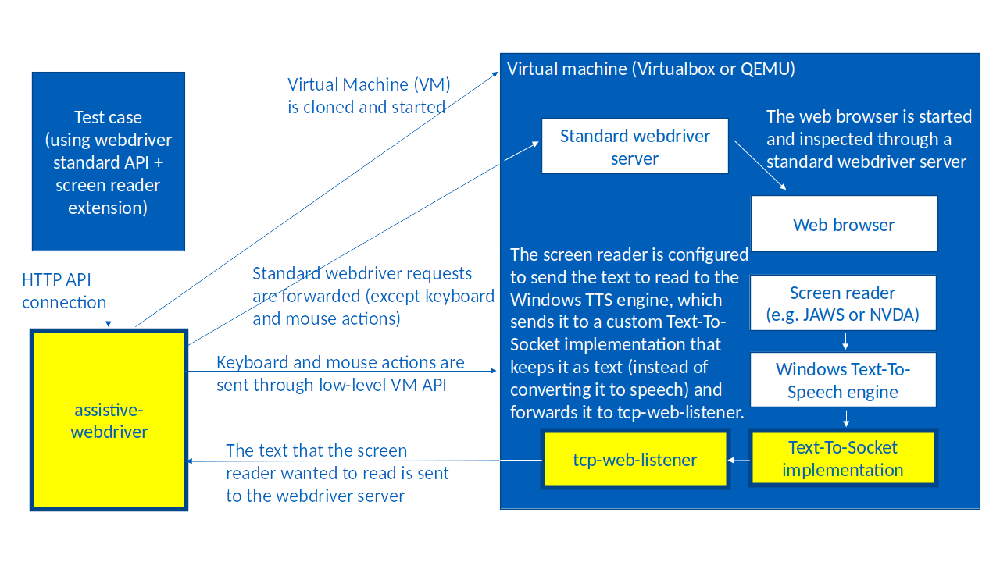

[](https://codecov.io/gh/AmadeusITGroup/Assistive-Webdriver)

# Presentation

This repository contains a set of components to automate end-to-end web application tests with a screen reader.

Web sites and web applications are increasingly required to be accessible, and, especially, compatible with screen readers, so that visually impaired users can use them.

To be sure that an application is compatible with a screen reader, it is important to test it in real conditions, which means using the application with the keyboard and listening to what the screen reader says. That is how a visually impaired user would interact with the application.

Most of the time those tests are currently done manually. The tools available in this repository allow to automate them.

## Assistive-Webdriver

Assistive-webdriver is an implementation of a Webdriver server that allows testing a scenario in a web application with a screen reader and checking that the screen reader says what is expected.

Concretely, it adds screen reader-related functions to webdriver.

For example:

```js
await driver.wait(forScreenReaderToSay("Date of departure"), 5000);
```

It also allows keystrokes to be sent low-level enough to pass through the screen reader (unlike usual webdriver implementations that send keystrokes directly to the browser and bypass hooks in the operating system).

For example, the "down arrow" key usually makes a screen reader read the next thing on the screen:

```js
await driver.actions().sendKeys(Key.DOWN).perform();
```

Assistive-webdriver uses a virtual machine to run tests. Here is a schema describing how it works:



The 3 yellow boxes in this schema are the three components of Assistive-Webdriver, in the following three directories:

- [assistive-webdriver](components/assistive-webdriver)
- [text-to-socket-engine](components/text-to-socket-engine)
- [tcp-web-listener](components/tcp-web-listener)

Inside of the assistive-webdriver component, all calls to create, control, and destroy the virtual machine are made through the following component that can be used independently:

- [vm-providers](components/vm-providers)
