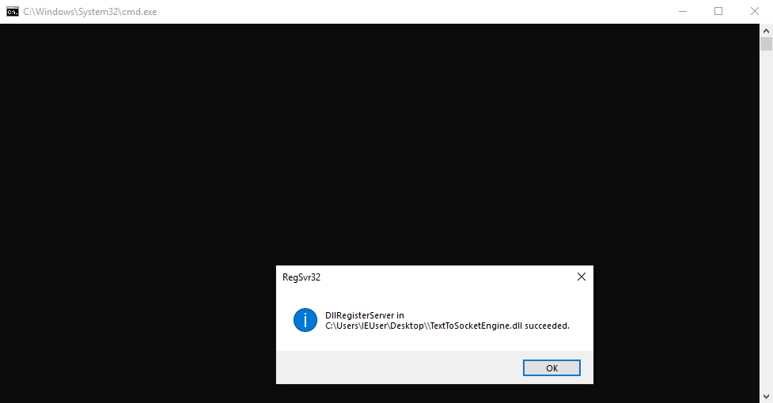
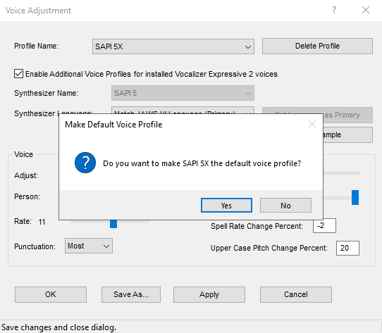
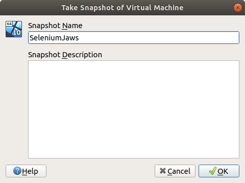

# Configuring a virtual machine

This guide explains how to configure a VirtualBox virtual machine to use it with `Assistive-Webdriver` for automated testing of a web application with the [JAWS](https://support.freedomscientific.com/Downloads/JAWS) screen reader.

This guide supposes [VirtualBox](https://www.virtualbox.org/) is installed on your machine.

## Download or install a Windows virtual machine

You need to have a VirtualBox virtual machine containing Windows. You can either install it yourself, or you can download one from Microsoft [here](https://developer.microsoft.com/en-us/microsoft-edge/tools/vms/).

If you choose to download it from the previous link from Microsoft, choose the `VirtualBox` platform. This will trigger the download of a `.zip` file that contains a `.ova` file that you can open with VirtualBox to import the virtual machine:


Click on `Import`. Importing the appliance can take several minutes.

Once the operation is finished, double-click on the machine (called `MSEdge - Win10` by default) in the list of machines to start it.

When requested, login as the `IEUser` user with the `Passw0rd!` password.

## Install required software in the virtual machine

Once the virtual machine is fully started, follow the following steps inside the virtual machine:

- Download and install the browsers you want to be able to use for testing, and their associated drivers. Note that drivers should be installed in a directory that is included in the PATH, so that the Selenium Server can find them.

| Browser | Browser download link | Driver download link |
|---------|-----------------------|----------------------|
| Firefox | [Download Firefox](https://www.mozilla.org/en-US/firefox/new/) | [Download geckodriver](https://github.com/mozilla/geckodriver/releases) |
| Chrome  | [Download Chrome](https://www.google.com/chrome/) | [Download ChromeDriver](https://chromedriver.chromium.org/) |
| Edge              | [Download Edge](https://www.microsoft.com/en-us/edge) | [Download Edge Driver](https://developer.microsoft.com/en-us/microsoft-edge/tools/webdriver/) |
| Internet Explorer | [Download IE](https://support.microsoft.com/en-us/help/17621/internet-explorer-downloads) | [Download IE Driver Server](https://www.selenium.dev/downloads/) |

- Download and install [Java](https://www.java.com). Java is needed in order to run Selenium Server.

- Download [Selenium Server](https://www.selenium.dev/downloads/) and store the `.jar` file somewhere in the virtual machine.

- Download TextToSocketEngine and extract the full content of the zip file somewhere in the virtual machine. Then execute the `register.cmd` script as an administrator (right-click on the file, then click on `Run as administrator`).



- Download and install [JAWS](https://support.freedomscientific.com/Downloads/JAWS).

- Configure `JAWS` to use `TextToSocketEngine`:

  - In the `Options` menu, select `Voices` and click on `Voice Adjustment`:

  

  - In the `Voice Adjustment` dialog, select `SAPI 5X - (factory)` in the `Profile Name` field. Then choose `textToSocketVoice` in the `Person` field of the `Voice` section. Then click on `OK`.

  

  - JAWS then asks whether you want to make `SAPI 5X` the default voice profile. Simply click on `Yes`.

  

  - JAWS is now correctly configured to use `TextToSocketEngine`.

- Download and install [Node.js](https://nodejs.org). Node.js is needed in order to run `tcp-web-listener`.

- From the command line, execute the following commands to install `tcp-web-listener` and start it:

```
npm install -g tcp-web-listener
tcp-web-listener --http-host 0.0.0.0
```

- Start Selenium server:

```
java -jar selenium-server-standalone-3.141.59.jar
```

- Make sure `JAWS` is running.

- Take a snapshot of the running virtual machine (with the `Take snapshot` command from the `Machine` menu). The name of the snapshot, along with the name of the virtual machine should be included in the `Assistive-Webdriver` [configuration file](../configuration.md).



After taking the snapshot of the running virtual machine, the virtual machine can be closed.
