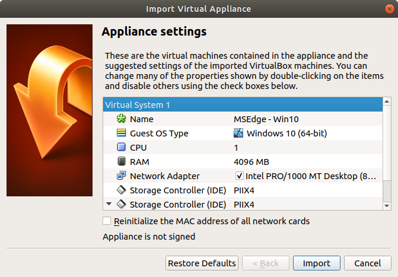
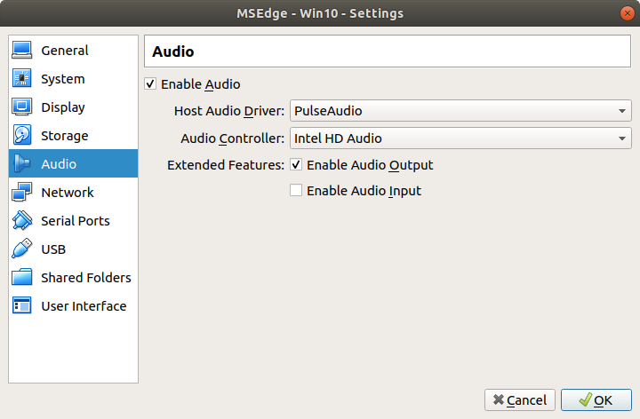
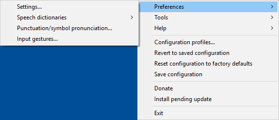
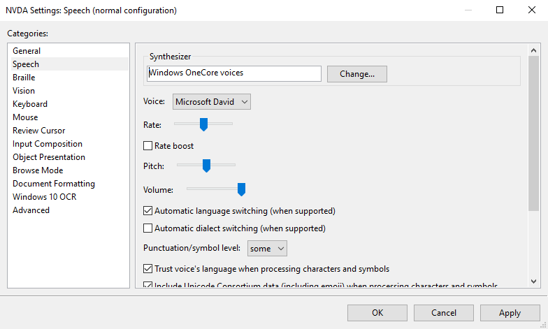
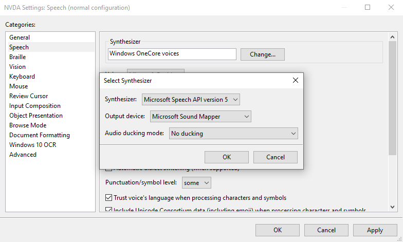
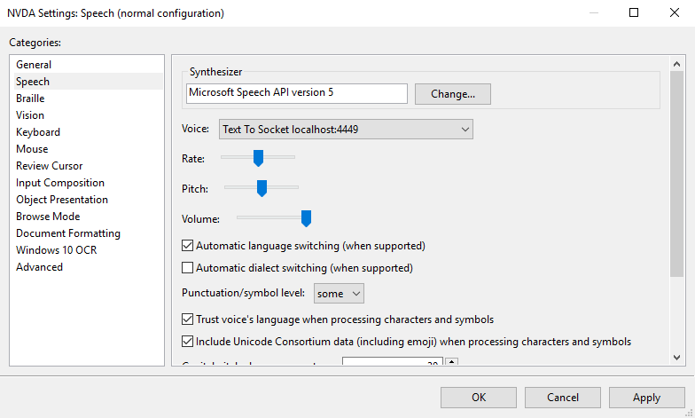
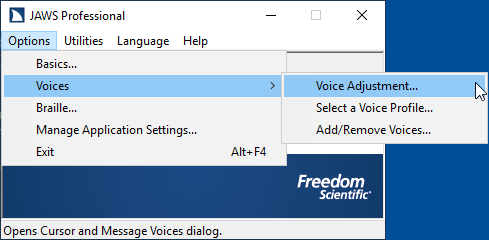
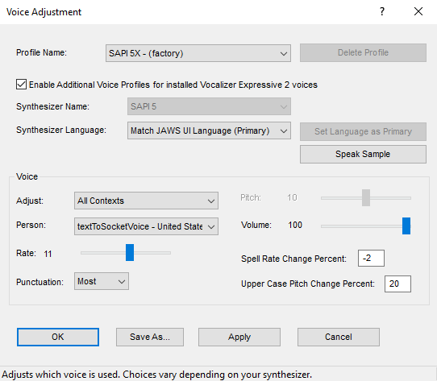

# Configuring a virtual machine

This guide explains how to configure a VirtualBox virtual machine to use it with `Assistive-Webdriver` or `Assistive-Playwright` for automated testing of a web application with the [NVDA](https://www.nvaccess.org/download/) or [JAWS](https://support.freedomscientific.com/Downloads/JAWS) screen reader.

Note that if you look for an already built virtual machine, you can find one on [Vagrant Cloud](https://app.vagrantup.com/assistive-webdriver/boxes/win10-chromium-nvda). If you look for an automated script that builds this kind of virtual machine, you can have a look at the [win10-chromium-nvda](../../vagrant/win10-chromium-nvda) folder.

This guide supposes [VirtualBox](https://www.virtualbox.org/) is installed on your machine.

## Download or install a Windows virtual machine

You need to have a VirtualBox virtual machine configured with a sound card and containing Windows. You can either install it yourself, or you can download one from Microsoft [here](https://developer.microsoft.com/en-us/microsoft-edge/tools/vms/).

If you choose to download it from the previous link from Microsoft, choose the `VirtualBox` platform. This will trigger the download of a `.zip` file that contains a `.ova` file that you can open with VirtualBox to import the virtual machine:



Click on `Import`. Importing the appliance can take several minutes.

Once the operation is finished, add a sound card to the virtual machine. To do this, right-click on the machine (called `MSEdge - Win10` by default) and click on `Settings`. Click on `Audio` in the list on the left and check `Enable Audio`. Then click on `OK`:



Then double-click on the machine in the list of machines to start it.

When requested, login as the `IEUser` user with the `Passw0rd!` password.

## Install required software in the virtual machine

Once the virtual machine is fully started, follow the following steps inside the virtual machine:

- If you plan to use `Assistive-Webdriver`, download and install the browsers you want to be able to use for testing, and their associated drivers. Note that drivers should be installed in a directory that is included in the PATH, so that the Selenium Server can find them. If you only plan to use `Assistive-Playwright`, the three compatible browsers (`chromium`, `firefox` and `webkit`) are downloaded automatically when installing `assistive-playwright-server`, so you can skip this step.

| Browser           | Browser download link                                                                     | Driver download link                                                                          |
| ----------------- | ----------------------------------------------------------------------------------------- | --------------------------------------------------------------------------------------------- |
| Firefox           | [Download Firefox](https://www.mozilla.org/en-US/firefox/new/)                            | [Download geckodriver](https://github.com/mozilla/geckodriver/releases)                       |
| Chrome            | [Download Chrome](https://www.google.com/chrome/)                                         | [Download ChromeDriver](https://chromedriver.chromium.org/)                                   |
| Edge              | [Download Edge](https://www.microsoft.com/en-us/edge)                                     | [Download Edge Driver](https://developer.microsoft.com/en-us/microsoft-edge/tools/webdriver/) |
| Internet Explorer | [Download IE](https://support.microsoft.com/en-us/help/17621/internet-explorer-downloads) | [Download IE Driver Server](https://www.selenium.dev/downloads/)                              |

- If you plan to use `Assistive-Webdriver`, download and install [Java](https://www.java.com). Java is needed in order to run Selenium Server. It is not needed if you only plan to use `Assistive-Playwright`.

- If you plan to use `Assistive-Webdriver`, download [Selenium Server](https://www.selenium.dev/downloads/) and store the `.jar` file somewhere in the virtual machine. It is not needed if you only plan to use `Assistive-Playwright`.

- Download and install [Node.js](https://nodejs.org). Node.js is needed in order to run `tcp-web-listener` and `assistive-playwright-server`, and it includes `npm` that can be used to install `text-to-socket-engine`.

- From the command line with administrator privileges, execute the following commands to install `text-to-socket-engine` and to register it:

```
npm install -g text-to-socket-engine
text-to-socket-engine-register
```

- Download and install [NVDA](https://www.nvaccess.org/download/) or [JAWS](https://support.freedomscientific.com/Downloads/JAWS).

- Configure `NVDA` or `JAWS` to use `TextToSocketEngine`:

  - For NVDA:

    - Right-click on the NVDA icon in the task bar, select `Preferences` and click on `Settings...`:

    

    - In the `NVDA Settings` dialog, click on the `Speech` category in the list on the left:

    

    - Click on the `Change...` button next to the `Synthesizer` field to choose another synthesizer.

    - In the `Select Synthesizer` dialog, choose `Microsoft Speech API version 5` in the `Synthesizer` field, and click on OK:

    

    - In the `NVDA Settings` dialog, select `Text To Socket localhost:4449` in the `Voice` field, and click on `OK`:

    

    - NVDA is now correctly configured to use `TextToSocketEngine`.

  - For JAWS:

    - In the `Options` menu, select `Voices` and click on `Voice Adjustment`:

    

    - In the `Voice Adjustment` dialog, select `SAPI 5X - (factory)` in the `Profile Name` field. Then choose `textToSocketVoice` in the `Person` field of the `Voice` section. Then click on `OK`.

    

    - JAWS then asks whether you want to make `SAPI 5X` the default voice profile. Simply click on `Yes`.

    

    - JAWS is now correctly configured to use `TextToSocketEngine`.

- If you want to use `Assistive-Playwright`, from the command line, execute the following commands to install `assistive-playwright-server`:

```
npm install -g assistive-playwright-server
assistive-playwright-server
```

- If you only want to use `Assistive-Webdriver`, from the command line, execute the following commands to install `tcp-web-listener` and start it. Note that this step is not needed if you installed `assistive-playwright-server` at the previous step, because it includes the feature provided by `tcp-web-listener`.

```
npm install -g tcp-web-listener
tcp-web-listener --http-host 0.0.0.0
```

- If you want to use `Assistive-Webdriver`, start Selenium server:

```
java -jar selenium-server-standalone-3.141.59.jar
```

- Make sure `JAWS` is running.

- Take a snapshot of the running virtual machine (with the `Take snapshot` command from the `Machine` menu). The name of the snapshot, along with the name of the virtual machine should be included in the `Assistive-Webdriver` [configuration file](../../components/assistive-webdriver/configuration.md) or in the parameters passed to `createVM` in `Assistive-Playwright`.


After taking the snapshot of the running virtual machine, the virtual machine can be closed.
